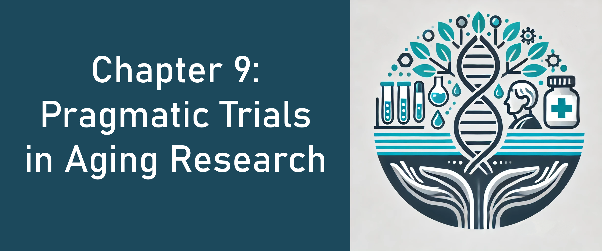

<div align="center" style="margin-top: 20px;">
  <a href="https://link.springer.com/chapter/10.1007/978-3-031-76469-1_9">
    
  </a>
</div>

[](https://link.springer.com/chapter/10.1007/978-3-031-76469-1_9)

# Description

This repository contains the associated supplementary materials for the chapter entitled "Chapter 9 - Pragmatic Trials", which is part of the 3rd edition of the book Aging Research - Methodological Issues. You can [consult the chapter here](https://link.springer.com/chapter/10.1007/978-3-031-76469-1_9).

## Usage

You will find the descriptions of the methods of the systematic literature search on the [docs](docs/) directory, as well as a report with the R version and package dependencies for the project. Figures and tables referenced in the chapter can be found in the [results](results/) file. The code for reproducibility of such outputs can be found in the [R folder](R/). 

## Project Structure

The project structure distinguishes three kinds of folders:

-   read-only (RO): not edited by either code or researcher

-   human-writable (HW): edited by the researcher only.

-   project-generated (PG): folders generated when running the code; these folders can be deleted or emptied and will be completely reconstituted as the project is run.

```         
.
├── .gitignore
├── CITATION.cff
├── LICENSE
├── README.md
├── data                  <- All project data
│   ├── processed         <- The final, canonical data sets. (PG)
│   ├── raw               <- The original, immutable data. (RO)
├── docs                  <- Documentation notebook for users (HW)
├── results
│   ├── output_figures    <- Figures for the manuscript or reports (PG)
│   └── output_tables     <- Other output for the manuscript or reports (PG)
└── R                     <- Source code for this project (HW)
```

# PRECIS-2 Examples   
An example of two hypothetical trials, one being explanatory and the other pragmatic on the [PRECIS-2](https://www.precis-2.org/Help/Documentation/Help) spectrum is available in the [PRECIS-2-example repository](https://github.com/javimangal/PRECIS-2-example).

## License

This project is licensed under the terms of the [MIT License](/LICENSE).

This project structure template repository is adapted from the [Good Enough Project](https://github.com/bvreede/good-enough-project) Cookiecutter template by Barbara Vreede (2019).
